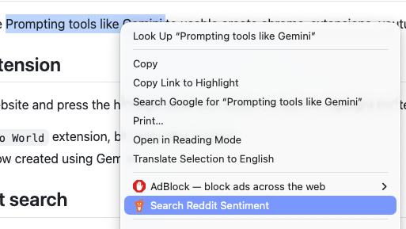

# AI scripting playground
Using publicly available Prompting tools like Gemini to create usable chrome-extensions, youtube analysis, etc.

## Text highlight Extension
Select any text on a website and press the highlight extension button, it will live highlight the text on the page.
 - Equivalent to a `Hello World` extension, but with Vibe coding!
 - Just a simple workflow created using Gemini

## Reddit Sentiment search
Select any text/phrase on a website & right-click to search the topic on reddit.com
 - Generic search for any topic
 - Opens a new tab a presents the search results on reddit
 - Yep, vibe coded.

#### Install Extension on Chrome: 
 - Download the extension directory
 - Goto `chrome://extensions/`
 - Select `load unpacked` 
 - Choose `select directory`, and
 - point to extension directory.
 - Done